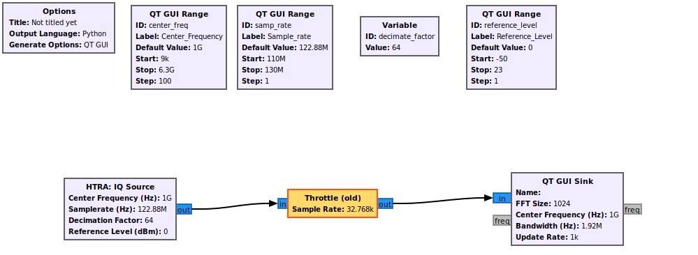
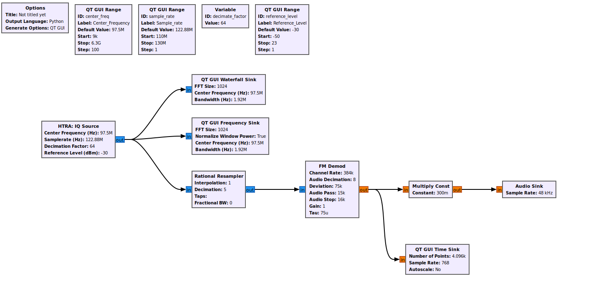
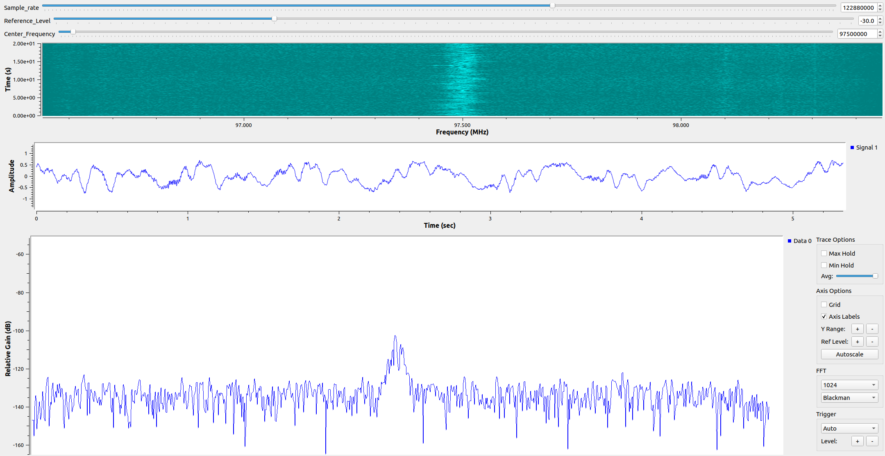
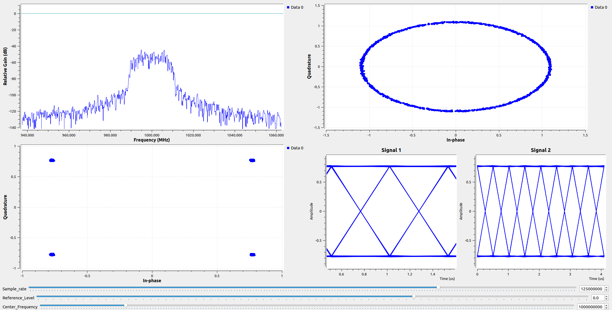
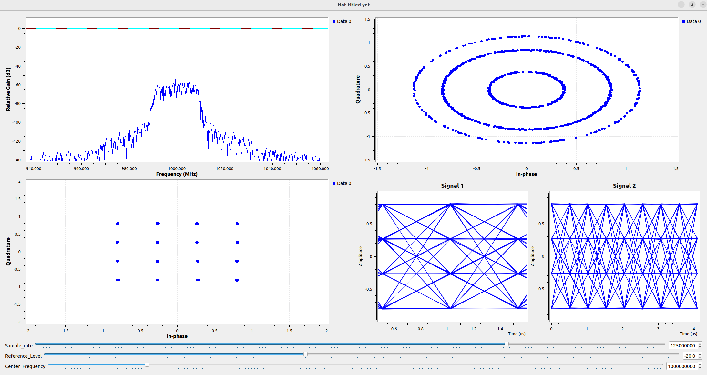
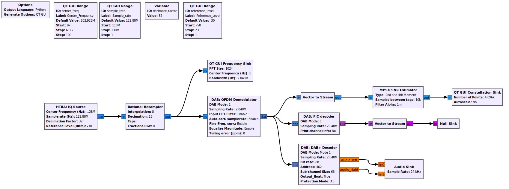
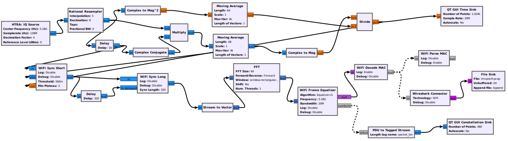

# Open Source Usage Notice

---

The open-source projects, code snippets, and related files contained in this sample folder are obtained from their original open-source communities or repositories.
This sample is provided solely for **Reference and Demonstration** purposes and is not intended for any commercial use.

- This sample does not redistribute, sublicense, or relicense any modified versions of the referenced open-source projects.
- No ownership or intellectual property rights over the referenced open-source projects are claimed; all rights remain with their respective authors and communities.  
- Users are solely responsible for ensuring compliance with the original open-source licenses (including but not limited to GPL, LGPL, Apache, MIT, etc.) when using the referenced projects.
- This document and the accompanying sample are provided as is and shall not be construed as any form of warranty, guarantee, or legal commitment regarding the referenced open-source projects.  

For any actual use of the referenced open-source projects, please review and comply strictly with the applicable original license terms.

# Sample Description
---

## 1. IQ_streaming.grc

**Purpose**  
Acquire basic IQ data.

**Parameter Description**  
- Native sample rate: 110 MHz to 130 MHz, step size 1 kHz
- Center frequency: determined by the device  
- Decimation factor: must ne set to a power of 2, selectable via the dropdown menu in the module  
- Reference level: -50 to +23 dBm  

**Usage Instructions**  
Configure the parameters as needed. then run. Notes:  
- The decimation factor must be selected in the `HTRA:IQ Source` module dropdown menu, and the same value must also be set in `Variable`  

**grc**
<p align="center">
  <a href="photos/IQ_streaming.png" title="IQ_streaming Flowgraph">
    
  </a>
</p>

**Demo Execution**
<p align="center">
  <a href="photos/IQ_streamingresult.png" title="IQ_streamingresult Flowgraph">
    
  </a>
</p>

---

## 2. FM_demod.grc

**Purpose**  
FM signal demodulation. It can demodulate FM signals from a standard signal source or FM broadcasts received via an antenna.

**Usage Instructions**  
Set the center frequency according to the use case, then run. Other parameters can be fine-tuned as needed.  

**grc**
<p align="center">
  <a href="photos/FM_demod.png" title="FM Demod Flowgraph">
    
  </a>
</p>

**Demo Execution**
<p align="center">
  <a href="photos/FM_demodresult.png" title="FM_demodresult Flowgraph">
    
  </a>
</p>

---

## 3. AM_demod.grc

**Purpose**  
AM signal demodulation. It can demodulate AM signals from a standard signal source.

**Usage Instructions**  
Same as FM_demod. Set the center frequency according to the use case, then run.

**grc**
<p align="center">
  <a href="photos/AM_demod.png" title="AM_demod Flowgraph">
    
  </a>
</p>

**Demo Execution**
<p align="center">
  <a href="photos/AM_demodresult.png" title="AM_demod Flowgraph">
    
  </a>
</p>

---

## 4. QPSK_demod.grc

**Purpose**  
QPSK signal demodulation.

**Parameter Description**  
In addition to the common parameters, the following must be configured:  
- symbol_rate
- excess_bw
- Samples per Symbol, SPS

**Usage Instructions**  
- Symbol synchronization is achieved through Symbol Sync, and carrier synchronization is achieved through Costas Loop.  
- The sample can directly demodulate a 250 kHz QPSK signal.  
- To demodulate other signals, fine-tune the parameters as needed.  

**grc**
<p align="center">
  <a href="photos/QPSK_demod.png" title="QPSK_demod Flowgraph">
    
  </a>
</p>

**Demo Execution**
<p align="center">
  <a href="photos/QPSK_demodresult.png" title="QPSK_demodresult Flowgraph">
    
  </a>
</p>

---

## 5. QAM_demod.grc

**Purpose**  
QAM signal demodulation, currently supporting QAM16 and QAM64.

**Parameter Description**  
In addition to the common parameters, the following must be configured:  
- symbol_rate
- excess_bw
- Samples per Symbol, SPS
- Constellation Object (defines the modulation scheme)  

**Usage Instructions**  
- Symbol synchronization is achieved through Symbol Sync, and carrier synchronization is achieved through DDPLL. (This is a non-official demo mudule; users can replace it with improved versions.)
- The sample can directlty demodulate a 250 kHz QAM16 signal.
- To demodulate other signals, fine-tune the parameters as needed.

**grc**
<p align="center">
  <a href="photos/QAM_demod.png" title="QAM_demod Flowgraph">
    
  </a>
</p>

**Demo Execution**
<p align="center">
  <a href="photos/QAM_demodresult.png" title="QAM_demodresult Flowgraph">
    
  </a>
</p>

---

## 6. ADSB_rx.grc

**Purpose**  
Demodulate flight signals and plot flight paths on a web page.

**Parameter Description**  
Optimized parameters are provided and can be used directly. For better performance, parameters may be adjusted as needed.  

**Usage Instructions**  
- This sample depends on the open-source project [gr-adsb](https://github.com/mhostetter/gr-adsb). Ensure the project is installed before use, otherwise modules may be missing.  
- After configuring the gr-adsb project, if you want to view flight paths on the web page, please note:  
  - The gr-adsb `gr-adsb/web/static/index.html` uses `socket.io` v2.0.0 by default. On newer Ubuntu systems, upgrade to v4.6.1 to display flight paths correctly.  
- It is recommended to use an antenna with good gain performance in the 1090 MHz band.  

**grc**
<p align="center">
  <a href="photos/ADSB_demod.png" title="ADSB_rx Flowgraph">
    
  </a>
</p>

**Demo Execution**
<p align="center">
  <a href="photos/ADSB_demodresult.png" title="ADSB_demodresult Flowgraph">
    
  </a>
</p>

---

## 7. DAB_receiver.grc

**Purpose**  
DAB (Digital Audio Broadcasting) signal demodulation.

**Parameter Description**  
Optimized parameters are provided and can be used directly.  

**Usage Instructions**  
- This sample depends on the open-source project [gr-dab](https://github.com/andrmuel/gr-dab). Ensure the project is installed before use, otherwise modules may be missing.
- After setting up the required dependencies, configure an appropriate center frequency to perform DAB signal demodulation.

**grc**
<p align="center">
  <a href="photos/DAB_demod.png" title="DAB_demod Flowgraph">
    
  </a>
</p>

**Demo Execution**
<p align="center">
  <a href="photos/DAB_demodresult.png" title="DAB_demodresult Flowgraph">
    
  </a>
</p>

---

## 8. WLAN_receiver.grc

**Purpose** 
WLAN signal demodulation in the air

**Parameter Description**  
Optimized parameters are provided and can be used directly.  

**Usage Instructions**  
- This sample depends on the open-source project [gr-ieee802-11](https://github.com/bastibl/gr-ieee802-11), **maint-3.10** branch.
  Before using this example, please install the project and its dependencies according to the **gr-ieee802-11** README to avoid missing modules.

- When running on **Ubuntu system**, it is necessary to adjust the **maximum shared memory of the system**. 
  This is because the **Transmitter** block in **gr-ieee802-11** uses the **Tagged Stream** mechanism, which buffers the entire frame in memory before processing. 
  Since the dafault shared memory size in Ubuntu is small, this may lead to insufficient buffer space.
  To fix this, execute the following command:

  ```bash
  sudo sysctl -w kernel.shmmax=2147483648
  ```

- After completing the above configuration, you can run this sample normally to perform WLAN signal acquisition and demodulation.

**grc**
<p align="center">
  <a href="photos/WLAN_demod.png" title="WLAN_demod Flowgraph">
    
  </a>
</p>

**Demo Execution**
- Constellation
<p align="center">
  <a href="photos/WLAN_demodresult1.png" title="WLAN_demodresult1 Flowgraph">
    
  </a>
</p>

- Demodulated data output
<p align="center">
  <a href="photos/WLAN_demodresult2.png" title="WLAN_demodresult2 Flowgraph">
    
  </a>
</p>

- wireshark
<p align="center">
  <a href="photos/WLAN_demodresult3.png" title="WLAN_demodresult3 Flowgraph">
    
  </a>
</p>
---
