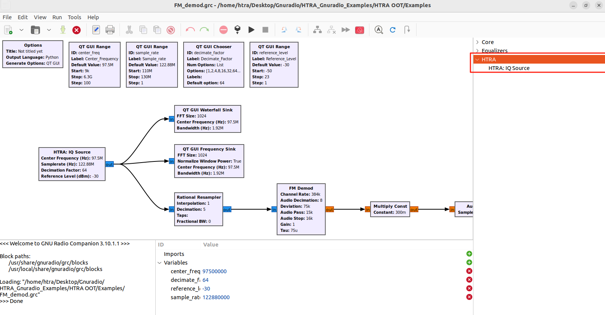

# gr-htra
A GNU Radio source module for HTRA SDR devices, providing real-time IQ data streaming and control via the Harogic API.

## Requirements
- 64-bit Linux operating system  
  - Tested on Ubuntu 20.04 and above
- Native USB 3.0 support

## Prerequisites
1. Install [**GNU Radio**](https://wiki.gnuradio.org/index.php/InstallingGR)  
   - GNU Radio 3.9 or above is required.

2.  Before building, you must have the following installed on your system:
   - **CMake**: `cmake`  
   - **C++ Compiler**: `g++`  
   - **Git**: `git`  
   - **Pybind11**: `pybind11`

   Example installation on Ubuntu:
  ```bash
  sudo apt update
  sudo apt install -y git cmake g++ libpython3-dev python3-numpy python3-pip python3-setuptools pybind11-dev
  ```

## Installation
1. Install [**HTRA API SDK Linux**](https://www.harogic.com/05561-apis/)
  - Use the Linux SDK included on the USB drive provided with your purchase, or download the latest Linux SDK from the official website.
   Then, in that folder, run:
```bash
sudo sh install_htraapi_lib.sh
```
2. Clone the repository
```bash
git clone https://github.com/HAROGIC-Technologies/gr-htra.git
```
3. Copy the calibration file(s)
   - Copy the calibration file(s) for your device from the included USB drive into the `gr-htra/CalFile` folder.
   - Then install the calibration file(s) system-wide.
```bash
cd gr-htra
sudo sh install_lib.sh
```
4. Build the Module
   - Build the module with CMake:
```bash
mkdir build
cd build
cmake ..
sudo make install
```

## Usage
- Add the `HTRA:IQ Source` block to flowgraphs in the GNU Radio Companion. It is located under the HTRA category.
  - See `examples` folder for demos.
<p align="center">
  <a href="Examples/FM_demod.png" title="FM Demod Flowgraph">
    
  </a>
</p>
